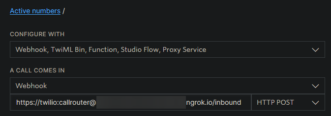

# TwilioCallRouter

TwilioCallRouter allows users using Twilio for SIP phones to route their calls to another number depending on prefix rules.

## Configuration

The first time you run TwilioCallRouter, it will generate a config file. Edit the config file as needed, and restart TwilioCallRouter.

By default, TwilioCallRouter will run on port 8500.
```yaml
port: 8500
```

To configure Basic Auth, change the below settings as needed. Ensure that your auth details are URL-safe, sticking with alphanumeric characters is recommended.
```yaml
auth: true
username: twilio
password: callrouter
```

You can specify the voice and language to pass to Twilio when using the `<Say>` verb. Check the comments in the config file for more information.
```yaml
voice: ALICE
language: EN_GB
```

If you would like to transfer calls to another SIP user, you can enable SIP REFERs. See the comments in the config file for more information.
```yaml
enable_refer: true
refer_force_https: false
```

### Directional Config

Both `inbound` and `outbound` support the following options:
```yaml
timeout: 20
answerOnBridge: true
default: '+17185550123'
```

Additionally, both directions support the same config format for `block_prefixes`. For each prefix, one of the following can be used:
- `say: 'some text here'`: This will instruct Twilio to say the string using the voice and language configured, before ending the call with `<Hangup>`.
- `say: false`: This will end the call using the `<Reject>` verb.
- `twiml: '<Response>...</Response>'`: This will respond with custom TwiML.

You can also specify custom handlers for both directions. The `custom_handlers` section is split into two parts: `exact` and `prefix`. For each number, you will need to specify the URL (which must serve valid TwiML) that Twilio will connect to, and the HTTP method (either `GET` or `POST`).

#### Inbound

In addition to the above, `inbound` allows for the default number to be a SIP URI. To use a SIP URI, set the `sip` setting to `true` and configure the `default` setting to be a SIP URI.

The routed config for `inbound` looks like this:
```yaml
routed:
  '+1':
    sip: false
    number: '+17185550123'
```

The above config means that any calls coming from a number starting with `+1` will be forwarded to `+17185550123`.

#### Outbound

You will also need to configure the `default_country_code` setting for outbound calls. If a called number is in a local format (not starting with `+` or `00`), the leading `0`, if it exists, will be dropped and the number will be prepended with `default_country_code`.

The routed config for `outbound` looks like this:
```yaml
routed:
  '+1': '+17185550123'
```

## Usage

After buying a number, configure it to use a webhook when a call is received. Set the webhook to TwilioCallRouter's `/inbound` route, using the POST method.



You will also need to create a SIP domain, configuring it to use a webhook. Set the webhook to TwilioCallRouter's `/outbound` route, using the POST method.

Installing TwilioCallRouter behind a reverse proxy, such as Nginx, and configuring SSL is recommended. If using REFERs, please ensure that your proxy passes the protocol to TwilioCallRouter, or enable `refer_force_https`. Also ensure that the correct host header is passed.

## Important Information

Due to complexities with extracting E.164 numbers from SIP URIs, calls to certain numbers are currently unsupported.

### Toll-free Numbers (+1)

For toll-free numbers using the +1 country code, you must dial the number in international format or without the leading `1`.

**Do not** call 18004444444, **instead** call 0018004444444 or 8004444444. A fix for this is planned for future releases.

### Short Numbers

Short numbers (such as emergency numbers) are not supported at all at this time. Please ensure you have another way of contacting emergency services in an emergency. Please note that calls to the following numbers are routed directly to the appropriate call center by Twilio and will not get sent to TwilioCallRouter: 112, 999, 911, 933.

### International Calling

All numbers are converted to E.164 numbers, which may have a different format to your country's usual international calling prefix. To call internationally, drop the leading `0` (if it exists) and prepend the number with `+` or `00` and then the country code. `00` will automatically be replaced with `+` before calling.

For example, if calling the UK number `02079460123`, call `00442079460123`.

### Cost

Certain configurations of TwilioCallRouter will incur a cost. While I have tried to document this wherever possible, it is your responsibility to review and understand Twilio's pricing before using TwilioCallRouter.